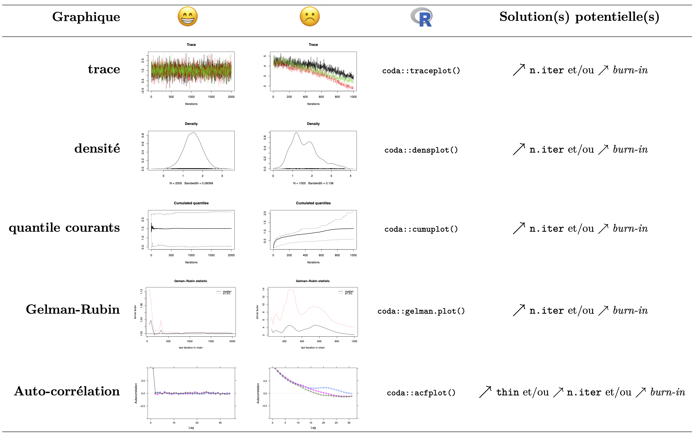

## Les algorithmes MCMC pour l'inférence bayésienne dans la pratique

La mise en place d'algorithmes de Metropolis-Hastings, de Gibbs ou de Metropolis à l'intérieur de Gibbs peut ainsi permettre d'échantillonner selon la loi *a posteriori* dans le cadre d'un modèle bayésien. On remplace alors $x$ par $\theta$ et $\tilde{p}$ par $p(\theta|\boldsymbol{y})$. Un certain nombre de logiciels tels que `JAGS` (http://mcmc-jags.sourceforge.net/), `STAN` (http://mc-stan.org/) ou `WinBUGS` (https://www.mrc-bsu.cam.ac.uk/software/bugs/the-bugs-project-winbugs/) propose une implémentation de tels algorithmes.

Le projet `BUGS` (*Bayesian inference Using Gibbs Sampling* : https://www.mrc-bsu.cam.ac.uk/software/bugs/) a été initié en 1989 par l'unité de Biostatistique du MRC (*Medical Research Council*) de l'Université de Cambridge (au Royaume-Uni) afin de proposer un logiciel flexible pour l'analyse bayésienne de modèles statistique complexe à l'aide d'algorithmes MCMC. Son implémentation la plus connue est `WinBUGS`, un logiciel clic-bouton disponible sous le système d'exploitation *Windows*. `OpenBUGS` est une implémentation fonctionnant sous *Windows*, *Mac OS* ou *Linux*. `JAGS` (*Just another Gibbs Sampler*) est une autre implémentation plus récente qui s'appuie également sur le langage `BUGS`. Une ressource très utile est le manuel de l'utilisateur de JAGS (http://sourceforge.net/projects/mcmc-jags/files/Manuals/3.x/jags_user_manual.pdf). Enfin, il faut également noter le logiciel `STAN`, récemment développé à l'Université de Columbia qui n'est similaire à `BUGS` que dans son interface, s'appuyant sur des algorithmes MCMC innovants, comme par exemple les approches de Monte-Carlo Hamiltonien ou l'approche variationnelle. 


### Convergence des algorithmes MCMC

L'échantillonnage selon la distribution *a posteriori* par un algorithme MCMC comporte 2 phases : 

 1. La **phase de chauffe** (*burn-in*) :  
 elle correspond aux premières itérations de l'algorithme MCMC, qui ne doivent pas être conservées dans l'analyse de l'échantillon de Monte-Carlo. En effet, celles-ci ne proviennent pas de la distribution. Cette phase correspond donc au temps nécessaire à la chaîne de Markov pour converger vers sa loi stationnaire. Sa longueur varie d'un modèle à l'autre. Il n'y a aucune conséquence à prendre une phase de chauffe trop longue, si ce n'est son coût computationnel.

 2. La **phase d'échantillonnage** :  
 elle doit être suffisamment longue pour permettre une bonne estimation de la distribution *a posteriori*, notamment concernant les plages de valeurs de faible probabilité.

Les propriétés mathématiques des chaînes de Markov garantissent la convergence des algorithmes MCMC, mais sans donner d'indication sur le nombre d'itérations de l'algorithme nécessaire pour atteindre cette convergence. S'il n'existe aucun moyen de garantir cette convergence en temps fini, il existe un certain nombre d'outils permettant de diagnostiquer la non-convergence d'une chaîne de Markov vers sa loi stationnaire. Il faut donc les utiliser de concert lors de l'interprétation des sorties d'un algorithme MCMC afin d'éviter les situations où la chaîne n'a pas convergé.

Une manière de surveiller la convergence d'un algorithme d'échantillonnage MCMC est de générer plusieurs chaînes (de façon parallèle et indépendante) avec des valeurs initiales différentes. Si l'algorithme fonctionne, alors ces différentes chaînes (de Markov) doivent converger vers la même distribution stationnaire (la loi *a posteriori*). Après suffisamment d'itérations, il devrait être impossible de faire la distinction entre ces différentes chaînes. Pour chaque chaîne, les $n$ premières valeurs sont considérées comme appartenant à **la phase de chauffe** (*burn-in*) de l'algorithme, nécessaire pour que la chaîne de Markov converge d'abord vers sa loi stationnaire à partir des valeurs initiales. Elles ne sont donc pas conservées, et on s'intéresse au $N$ observations suivantes qui vont constituer nos échantillons de Monte-Carlo.

#### Erreur de Monte-Carlo

L'erreur de Monte-Carlo caractérise l'incertitude introduite par l'échantillonnage MCMC. Pour un paramètre donné, elle quantifie la variabilité attendue dans son estimation si nous générerions plusieurs **chaînes**, c'est-à-dire plusieurs échantillons de Monte-Carlo *a posteriori* (grâce à un algorithme MCMC, avec différentes initialisations et à chaque fois un même nombre $N$ d'itérations). Les erreurs-types de Monte-Carlo donne une idée de cette variabilité. Si les erreurs standards ont des valeurs très différentes d'une chaîne à l'autre, alors il faut faire fonctionner l'échantillonneur plus longtemps. La longeure exacte de l'échantillonnage nécessaire pour obtenir une erreur-type donnée dépendra de l'efficacité et du mélange de l'échantillonneur.  Il est important que cette erreur de Monte-Carlo soit faible au regard de la variance estimée de la loi *a posteriori*.


#### Statistique de Gelman-Rubin

Une façon de d'évaluer la convergence d'un échantillonneur MCMC est de comparer la variation entre les différentes chaînes à la variation à l'intérieur d'une même chaîne après un certain nombre d'itérations. Si l'algorithme a bien convergé, la variation inter-chaîne doit être proche de zéro.

Soit $\theta_{[c]} = (\theta_{[c]}^{(1)}, \dots, \theta_{[c]}^{(N)})$ le $N$-échantillon obtenu à partir de la chaîne $c=1,\dots, C$ d'un algorithme MCMC échantillonnant $\theta$. La **statistique de Gelman-Rubin** s'écrit :

$$R=\dfrac{\frac{N-1}{N}W\frac{1}{N}B}{W}$$

\noindent avec $\textstyle B = \frac{N}{C-1}\sum_{c=1}^C (\bar{\theta}_{[C]} - \bar{\theta}_{\cdot})^2$ la variance inter-chaînes, $\textstyle \bar{\theta}_{[c]} = \frac{1}{N}\sum_{t=1}^N \theta_{[c]}^{(t)}$, $\textstyle \bar{\theta}_{\cdot} = \frac{1}{C}\sum_{c=1}^C \bar{\theta}_{[C]}$, et $\textstyle W = \frac{1}{C}\sum_{c=1}^C s_{[c]}^2$ la variance intra-chaîne, $\textstyle s_{[c]}^2 = \frac{1}{N-1}\sum_{t=1}^N (\theta_{[c]}^{(t)} - \bar{\theta}_{[C]})^2$. Lorsque $N\rightarrow +\infty$ tandis que $B\rightarrow 0$, $R$ s'approche de la valeur de 1. On va donc chercher à itérer suffisamment un algorithme MCMC afin d'obtenir une valeur de $R$ proche de 1, par exemple entre $1$ et $1,01$ ou $1,05$.

La statistique Gelman-Rubin est un ratio (donc sans unité) ce qui en fait un résumé s'interprétant simplement et de la même manière pour tout échantillonneur MCMC. Autre avantage, il ne nécessite pas de choisir au préalable un paramètre à estimer (contrairement aux erreurs de Monte-Carlo). La statistique de Gelman-Rubin est donc un bon moyen de diagnostiquer la convergence d'un algorithme MCMC. Néanmoins, son calcul peut être instable et elle ne peut garantir la convergence à elle seule. Il s'agit d'un outil général pour la surveillance plus générale d'une chaîne de Markov.

À noter que d'autres statistiques (par exemple la statistqiue de Geweke) sont parfois utilisées à la place ou en complément de celle de Gelman-Rubin, qui reste la plus populaire.

#### Diagnostiques graphiques

En complément de la statistique de Gelman-Rubin et, un certain nombre de diagnostiques graphiques peuvent permettre de diagnostiquer la non convergence d'un algorithme MCMC :

  - la **trace** : désigne la représentation des valeurs successives de la chaîne. Lorsque l'on génère plusiquers chaîne indépendante à partir d'initialisations différentes, les traces des différentes chaînes doivent se stabiliser et se superposer une fois la convergence atteinte.

  - **estimateur de densité non-paramétrique** (à noyau) : d'après le théorème de convergence de Bernstein-von Mises, la distribution *a posteriori* doit être unimodale. Pour cela on peut utiliser un estimateur de densité non-paramétrique (à noyau) sur l'échantillon de Monte-Carlo générer afin de vérifier que la loi *a posteriori* est bien unimodale et suffisament lisse.
  
 - les **quantiles courants** : de la même façon que la trace, les quantiles des différentes chaînes doivent se stabiliser et superposer au cours des différentes itérations une fois la convergence atteinte. 
 
 - le **diagramme de Gelman-Rubin** : on représente la statistique de Gelman-Rubin cumulée au cours des différentes itérations. Son niveau doit rapidement se retrouver très proche de 1 (idéalement $<1,01$ ou à minima $<1,05$)
 
 - l'**auto-corrélation** : Lorsque la chaîne de Markov ne "mixe" pas très bien, il peut arriver que les observations successives soient fortement corrélées d'une itération à la suivante. Cela n'est pas un problème en soit, mais cela diminue fortement la taille d'échantillon effective pour l'estimation *a posteriori*. Une solution courante est de ne conserver qu'une itération sur $2$, $5$ ou $10$ (on espacera les enregistrements d'autant plus que la corrélation est forte) à l'aide du paramètre d'épaisseur (*`thin`*, réglant l'espacement entre les itérations conservées dans l'échantillon MCMC).
 
 - la **corrélation croisée** : On peut également s'intéresser à la corrélation entre nos différents à travers les différents échantillons *a posteriori*. À noter qu'il est fréquent d'observer une forte corrélation entre certains paramètres et que ce n'est pas nécessairement indicateur d'un problème avec l'algorithme MCMC (l'approche fréquentiste également on estime des corrélations, parfois importantes, entre les paramètres d'un modèle grâce à la matrice d'information de Fisher).

\noindent 
*Remarque* : il est fréquent que les diagnostiques soient satisfaisants pour certains paramètres, mais ne le soient pas pour d'autres. Il s'agit d'une appréciation subjective, et l'objectif est que la majorité des critères soient satisfaits (ou plus ou moins satisfaits) pour une grande majorité des paramètres.


\afterpage{
\begin{landscape}
\begin{table}
\centering
\renewcommand{\arraystretch}{1.5}
\begin{tabular}{>{\bfseries}r c c c c}
    \hline
    \raisebox{.2\height}{\textbf{Graphique}} & \raisebox{-.2\height}{\includegraphics[height=20pt]{happy}} & \raisebox{-.2\height}{\includegraphics[height=20pt]{sad}} & \raisebox{-.2\height}{\includegraphics[height=18pt]{Rlogo2}} & \raisebox{.2\height}{\textbf{Solution(s) potentielle(s)}} \medskip \\
    \hline
    \centering trace & \raisebox{-.5\height}{\includegraphics[width=3.5cm]{goodTrace}} &  \raisebox{-.5\height}{\includegraphics[width=3.5cm]{badTrace}} & \scriptsize{\texttt{coda::traceplot()}} &  $\nearrow$~\footnotesize{\texttt{n.iter}} et/ou $\nearrow$~\footnotesize{\textit{burn-in}} \medskip \\
    densité & \raisebox{-.5\height}{\includegraphics[width=3.5cm]{goodDensity}} & \raisebox{-.5\height}{\includegraphics[width=3.5cm]{badDensity}} & \scriptsize{\texttt{coda::densplot()}} & $\nearrow$~\footnotesize{\texttt{n.iter}} et/ou $\nearrow$~\footnotesize{\textit{burn-in}}  \medskip \\
    quantile courants &  \raisebox{-.5\height}{\includegraphics[width=3.5cm]{goodCQ}} & \raisebox{-.5\height}{\includegraphics[width=3.5cm]{badCQ}} & \scriptsize{\texttt{coda::cumuplot()}} &  $\nearrow$~\footnotesize{\texttt{n.iter}} et/ou $\nearrow$~\footnotesize{\textit{burn-in}}  \medskip \\
    Gelman-Rubin & \raisebox{-.5\height}{\includegraphics[width=3.5cm]{goodGR}} &  \raisebox{-.5\height}{\includegraphics[width=3.5cm]{badGR}} & \scriptsize{\texttt{coda::gelman.plot()}} &  $\nearrow$~\footnotesize{\texttt{n.iter}} et/ou $\nearrow$~\footnotesize{\textit{burn-in}}  \medskip \\
    Auto-corrélation &  \raisebox{-.5\height}{\includegraphics[width=3.5cm]{goodAC}} &  \raisebox{-.5\height}{\includegraphics[width=3.5cm]{badAC}} & \scriptsize{\texttt{coda::acfplot()}} & $\nearrow$~\footnotesize{\texttt{thin}} et/ou $\nearrow$~\footnotesize{\texttt{n.iter}} et/ou $\nearrow$~\footnotesize{\textit{burn-in}}\\
    \hline
  \end{tabular}
  \caption{Exemples de référence pour les diagnostiques graphiques de convergence}
\end{table}
\end{landscape}
}

```{r, echo=FALSE, fig.cap="Exemples de référence pour les diagnostiques graphiques de convergence"}
if(knitr::is_html_output()){
  
}
```


#### Taille d'échantillon effective

Un échantillon généré à partir d'un algorithme MCMC n'est $iid$ en pratique que dans des cas très particuliers. En effet, la propriété de Markov entraîne généralement une corrélation entre les valeurs générées à la suite les unes des autres (échantillonnage dépendant). Pour une taille $N$ fixé d'échantillon, cette auto-corrélation diminue la quantité d'information et ralentit la convergence de la loi des grands nombres par rapport à un échantillon totalement indépendant. Un indicateur permettant de quantifier cette information est la **taille d'échantillon effective** (*effective sample size* en anglais) qui se calcule :
$$ESS = \dfrac{N}{1 + 2\sum_{k=1}^{+\infty} \rho(k)}$$
où $\rho(k)$ désigne l'auto-corrélation avec *lag* de rang $k$.

Un solution employée en pratique pour diminuer ces problèmes d'auto-corrélation est de ne pas conserver toutes les valeurs échantillonnées successivement par un algorithme MCMC, mais d'espacer les itérations conservées. Par exemple, on pourra ne conserver que les valeurs échantillonnées toutes les 2, 5, ou 10 itérations, ce qui permettra de diminuer la dépendance au sein de l'échantillon de Monte-Carlo généré.

### Inférence à partir d'échantillonnage MCMC

#### Estimation

Grâce aux algorithmes MCMC, on est donc capable d'obtenir un **échantillon de Monte-Carlo de la loi *a posteriori*** pour un **modèle bayésien** donné. On peut donc utiliser la **méthode de Monte-Carlo** pour obtenir différentes **estimations *a posteriori*** : estimation ponctuelle (moyenne *a posteriori*, médiane *a posteriori*, ...), intervalle de crédibilité (notamment grâce au *package* `r icon::fa_r_project(colour = "#0085d6")` `HDInterval` qui permet de calculer l'intervalle de crédibilité le plus étroit pour un niveau donné, c'est-à-dire le *Highest Density Interval --- $HDI$)), les corrélations croisées entre les paramètres, etc.


#### *Deviance Information Criterion* ($DIC$)

Le ***Deviance Information Criterion*** ($DIC$) s'appuie sur la déviance [^1], qui s'écrit comme : $D(\theta) = -2\log(p(\theta|\boldsymbol{y})) + C$ où $C$ est une constante. Le $DIC$ est alors définit par :
	$$DIC = \overline{D(\theta)} + p_D$$ où $p_D = \left(D(\overline{\theta}) - \overline{D(\theta)}\right)$ représente une pénalité pour le nombre effectif de paramètres. Le $DIC$ permet notamment de comparer différents modèles sur les mêmes données (plus il est bas, meilleur est le modèle), et de faire des choix de modélisation dans le contexte bayésien.

[^1]: M Plummer, Penalized loss functions for Bayesian model comparison, *Biostatistics*, 2008


